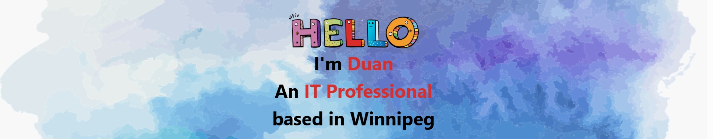

## About me

I’m an IT professional based in Winnipeg with practical experience in full-stack development, computer networking, and technical support, and a background as a product manager in the IT industry.

I will soon graduate from the Software Development program at MITT, where I focused on building dynamic, user-centered applications from the ground up. I enjoy designing intuitive user interfaces while also developing the underlying systems that ensure performance, security, and scalability.

Prior to moving to Canada, I worked in the IT industry in China as a product manager. That experience taught me to think from the user's perspective, work across disciplines, and deliver solutions that align with real-world needs. It also sparked my interest in software development and inspired me to pursue it professionally.

In addition to development, I have experience in computer networking and technical support, including PC repair, troubleshooting, and hardware and software installation. This broader technical background enables me to approach problems holistically and support systems end to end.

Feel free to explore my GitHub to see some of my development projects. If you'd like to connect or collaborate, don’t hesitate to reach out!

## My skills

    &nbsp;
    &nbsp;
    &nbsp;
    &nbsp;
    &nbsp;
    &nbsp;
     
    &nbsp;
    &nbsp;
    &nbsp;
    &nbsp;
    &nbsp;
     
    &nbsp;
    &nbsp;

## My GitHub Stats

### GitHub Statistics

### Contribution Graph

### Top Languages

